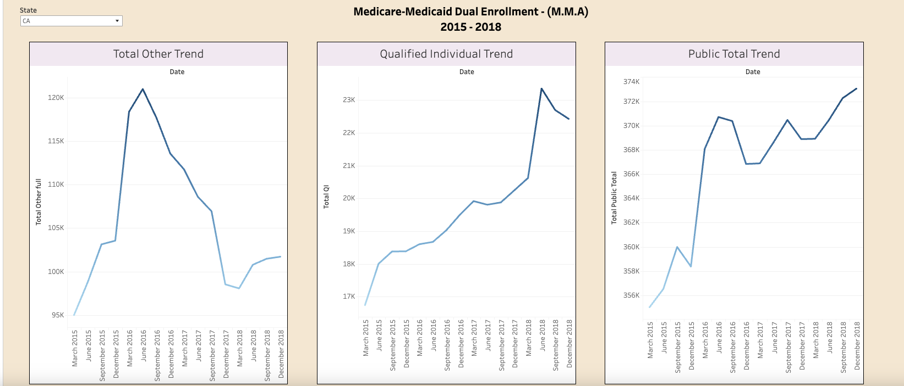

<h1 align="center">Hi 👋, I'm Richard DiazDeLeon </h1> 
<h1 align="center"> <a href="https://git.io/typing-svg"></h1>

<h1 align="center"> 🚀 About Me  <a href="https://www.linkedin.com/in/richard-d-740b2a24b/" target="_blank">
   
   
</h1> 

Hello! I'm Richard, a passionate mathematician and data enthusiast with a knack for extracting meaningful insights from complex datasets. My journey in data science is marked by hands-on experience gained through various internships, where I honed my proficiency in statistical programming and data visualization tools such as Tableau, SQL, and Excel. My expertise shines in the finance sector, where I've leveraged statistical methods to unravel financial trends, evaluate risks, and provide data-backed recommendations to optimize financial performance and key indicators.

My adventures in data don't stop there. Working within the healthcare sector has enriched my understanding of patient care dynamics, healthcare operations, and outcome optimization. I pride myself on adhering to the highest standards of data practices, ensuring the integrity and accuracy of my analyses.

At the heart of my approach is a blend of advanced data analytics and a deep dive into the nuances of finance and healthcare. I'm driven by the challenge of turning raw data into actionable insights that pave the way for informed decision-making.

But the learning never stops. I'm constantly seeking new horizons in data science, striving for excellence and hoping to inspire and support others along the way. I've taken my passion to platforms like Medium and Kaggle, pushing my limits with daily data challenges, and I continue to deepen my expertise in statistics, exploring the realms of predictive models and machine learning techniques.

For a deeper dive into my professional journey and projects, feel free to connect with me on   👉 [Linkedin](https://www.linkedin.com/in/richard-d-740b2a24b/)  .

<h1 align="center"> 👨‍💻 Current Projects 
<a href="https://public.tableau.com/app/profile/richard.diazdeleon" target="_blank">
   

   
</h1>
<li>
      United States Environmental Protection Agency (EPA) Air Quality Database Overview
      

       The United States Environmental Protection Agency (EPA) plays a pivotal role in safeguarding public health and the environment by setting national air quality standards. Annually, the EPA furnishes summary data alongside hourly and daily data, categorizing them into criteria gases, particulates, meteorological, and toxics.
      

   
<li>
      Evaluating the Effectiveness of a Wellness Program on Dual Enrollee Healthcare Utilization: A Monthly Snapshot Analysis from CMS Data
   

  

   

This project delves into a meticulous analysis of CMS data, focusing on the effectiveness of a wellness program targeting dual enrollees. The data set is unique as it offers monthly snapshots instead of the conventional cumulative annual counts. This approach provides a more dynamic and nuanced view, capturing enrollees' data at specific points each month. It's important to note that these snapshot figures generally present lower counts compared to the total ever-enrolled figures over a year, as they only account for individuals enrolled at the time of each snapshot.  👉 [Full Project](https://github.com/dsrichard97/Medicare_Dual_Enroll) 
      

   <li>
      Microsoft Stock Price - Change Point Detection
   

  

   

This project delves into a meticulous analysis of CMS data, focusing on the effectiveness of a wellness program targeting dual enrollees. The data set is unique as it offers monthly snapshots instead of the conventional cumulative annual counts. This approach provides a more dynamic and nuanced view, capturing enrollees' data at specific points each month. It's important to note that these snapshot figures generally present lower counts compared to the total ever-enrolled figures over a year, as they only account for individuals enrolled at the time of each snapshot.  👉 [Full Project](https://github.com/dsrichard97/Medicare_Dual_Enroll) 
      

      
      

<h1 align="center"> 📝 About My Works  </h1>

- 👨‍💻 All of my projects are available at [https://github.com/dsrichard97/portfolio](https://github.com/dsrichard97/portfolio)

- 📫 How to reach me **Richard.Diazdeleon01@student.csulb.edu**

<h1 align="center"> 🤖 Teck Stack </h1>

    
    
    
    
    
    
    
    
    
    
    
    
    
    
    
    
    
    
  

<h1 align="center"> 📈 Github Stats </h1>

<h1 align="center"> 🏆 Interesting Quote </h1>
“It is a capital mistake to theorize before one has data.” - Sherlock Holmes, “A Study in Scarlett” (Arthur Conan Doyle)

